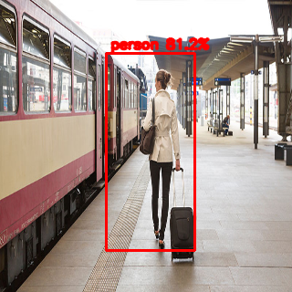
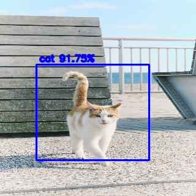
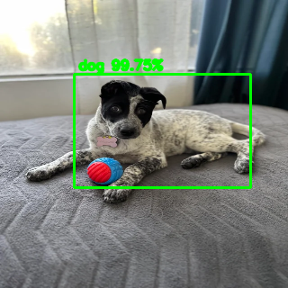
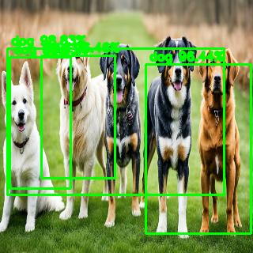
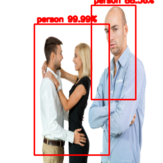
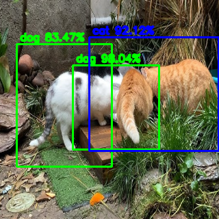

# Object Detection with Multi-scale Default Boxes

An SSD-style object detection project that predicts object classes and bounding boxes using multi-scale default boxes. The model focuses on three foreground classes, `cat`, `dog`, and `person`, plus a `background` class.

## Demo Results

The examples below show representative predictions produced by the detector on selected test images.

| Person detection | Cat detection |
| --- | --- |
|  |  |

| Dog detection | Multi-object detection |
| --- | --- |
|  |  |

| Mixed-class scene | Challenging multi-object scene |
| --- | --- |
|  |  |

## Project Highlights

- Built a compact SSD-inspired detection pipeline with multi-scale prediction heads.
- Generated `540` default boxes per image across `10 x 10`, `5 x 5`, `3 x 3`, and `1 x 1` feature-map scales.
- Implemented IoU-based matching between ground-truth boxes and default boxes.
- Trained the model to predict both class confidence and bounding box regression targets.
- Added visualization utilities for comparing ground truth, matched default boxes, predicted boxes, and predicted default boxes.

## Method Overview

The detector follows the Single Shot MultiBox Detector idea: it predicts object categories and bounding box offsets directly from multiple feature-map resolutions instead of using a separate region proposal stage.

Default boxes are generated on four prediction layers:

| Feature map | Cells | Default boxes per cell |
| --- | ---: | ---: |
| 10 x 10 | 100 | 4 |
| 5 x 5 | 25 | 4 |
| 3 x 3 | 9 | 4 |
| 1 x 1 | 1 | 4 |

Total default boxes:

```text
4 * (10 * 10 + 5 * 5 + 3 * 3 + 1 * 1) = 540
```

For each default box, the network predicts:

- class confidence over `cat`, `dog`, `person`, and `background`
- bounding box regression values

Ground-truth annotations are assigned to default boxes by IoU matching. Positive anchors are used for object classification and bounding box regression, while unmatched anchors remain background examples.

## Project Structure

```text
Object-detection/
+-- README.md
+-- .gitignore
+-- Report.docx
+-- assignment_3.pdf
+-- docs/
|   +-- images/             # Selected prediction examples
+-- materials/
    +-- main.py             # Training and testing entry point
    +-- model.py            # SSD network and loss definition
    +-- dataset.py          # Dataset loading, default boxes, IoU matching
    +-- utils.py            # Visualization, NMS, and evaluation helpers
    +-- data/
        +-- put data here.txt
```

Expected dataset layout:

```text
materials/data/
+-- train/
|   +-- images/
|   +-- annotations/
+-- test/
    +-- images/
    +-- annotations/
```

Annotation files should be `.txt` files with the same base name as the corresponding image.

## Setup

Install the main dependencies:

```bash
pip install numpy opencv-python torch torchvision
```

`materials/main.py` uses CUDA by default. For CPU-only execution, replace the `.cuda()` calls with CPU-compatible tensor/model usage.

## Training

Run from the `materials/` directory:

```bash
python main.py
```

Training reads:

- `materials/data/train/images/`
- `materials/data/train/annotations/`

The trained weights are saved as:

```text
materials/network.pth
```

## Testing

Run from the `materials/` directory:

```bash
python main.py --test
```

Testing reads:

- `materials/data/test/images/`
- `materials/data/test/annotations/`

The script loads:

```text
materials/network.pth
```

## Future Improvements

- Add hard negative mining for better foreground/background balance.
- Tune class weighting to reduce cat/dog confusion.
- Add stronger image augmentation for small and crowded objects.
- Implement non-maximum suppression for cleaner final predictions.
- Add mAP/F1 evaluation for quantitative model comparison.
